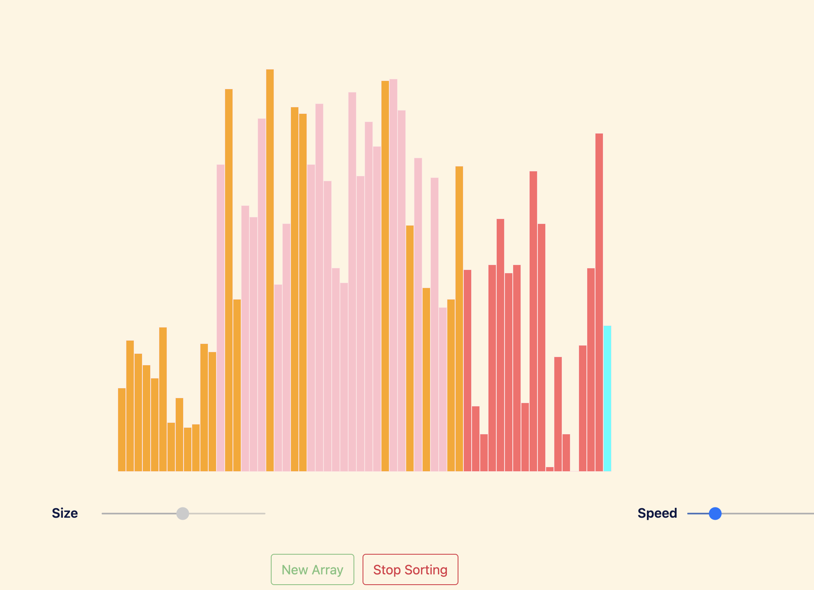

# AlgoViz: Interactive Sorting Algorithm Visualizer

## Overview

AlgoViz is an interactive web application that visualizes various sorting algorithms. The visualizer provides an engaging and educational experience, allowing users to observe the inner workings of sorting algorithms in real-time.

## Features

- **Interactive Visualization**: Visualize the sorting process step-by-step.
- **Multiple Algorithms**: Includes Bubble Sort, Merge Sort, Selection Sort, Quick Sort, Insertion Sort, and Heap Sort.
- **Adjustable Settings**: Control the array size and sorting speed.
- **Responsive Design**: Optimized for both desktop and mobile devices.

## Screenshots

## Technologies Used

- **HTML**: Structure of the application
- **CSS**: Styling of the application
- **JavaScript**: Logic and functionality of the sorting algorithms
- **Bootstrap**: For responsive design and UI components
